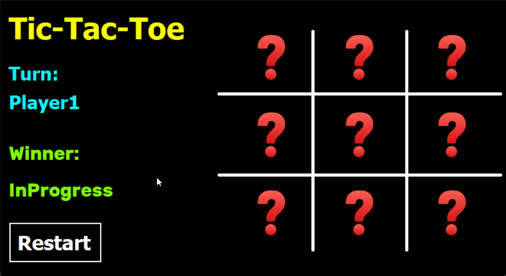

# ❌⭕ Tic-Tac-Toe Game (C# WinForms)

A classic **Tic-Tac-Toe** desktop application built using **C#** and **Windows Forms**. 

This project was developed as part of **Course 14** in the ProgrammingAdvices software engineering roadmap. It focuses on clean code architecture, state management using **Enums** and **Structs**, dynamic GDI+ line drawing, and the **Single Responsibility Principle (SRP)**.

---

## 📸 Application Preview

---

## ✨ Features

- **2-Player Gameplay:** Interactive turn-based play between Player 1 (X) and Player 2 (O).
- **Real-Time Win & Draw Detection:** Automatically evaluates rows, columns, and diagonals after every move.
- **Winning Line Highlighting:** Changes the background color of winning tiles to green-yellow.
- **Dynamic Board Rendering:** Uses custom GDI+ graphics (`Paint` event) to draw smooth board grid lines.
- **Unified Event Handling:** Efficiently routes all 9 board tile interactions through a single, clean event handler.
- **Game Reset:** Restores the board, images, and turn indicators to start a new game instantly.

---

## 🛠️ Tech Stack & Concepts

- **Language:** C#
- **Framework:** .NET / Windows Forms (WinForms)
- **IDE:** Visual Studio
- **Architecture Highlights:**
  - **State Management:** Uses strongly-typed `Enum` definitions (`Turn`, `WinState`) and a custom `GameInfo` struct to manage game state without hardcoded values.
  - **DRY Principle:** Iterates through controls dynamically using `foreach` loops to reset board states and handle control properties cleanly.
  - **GDI+ Drawing:** Custom `Paint` implementation using `System.Drawing.Pen` to render smooth grid lines with rounded caps.

---

## 🚀 How to Run

1. Clone the repository:
   git clone https://github.com/your-username/Tic-Tac-Toe-WinForms.git
2. Open the solution file (`*.sln`) in **Visual Studio**.
3. Press `F5` or click **Start** to build and run the game.

---

👨‍💻 **Developer:** Muhammad Shihab Al-Din Abdul Majid
